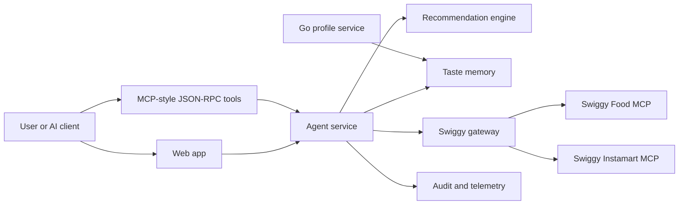

# Moodish Architecture

## Product Shape

Moodish exposes a generic meal-planning surface that any AI client can call. The agent service owns the MCP-style tools and recommendation contract. Swiggy MCP remains the downstream commerce provider.

## Provider-Agnostic AI

The app does not require OpenAI. `AI_PROVIDER` selects the model adapter:

- `mock`: deterministic local summaries for fixture-mode development and tests. This is explicitly marked as no external AI inference.
- `local`: call a local model gateway via `AI_PROVIDER_ENDPOINT`.
- `openai`, `anthropic`, `custom`: optional remote providers behind the same interface.

The core ranking path is deterministic, so the product is functional even without an LLM.

## Swiggy MCP Boundary

`SWIGGY_MODE=fixture` uses a safe local catalog. `SWIGGY_MODE=live` is intentionally isolated in the gateway so OAuth/session handling, retries, and observability are implemented in one place.

No order placement or checkout path should be added unless it requires explicit user confirmation and uses check-then-retry for non-idempotent calls.
